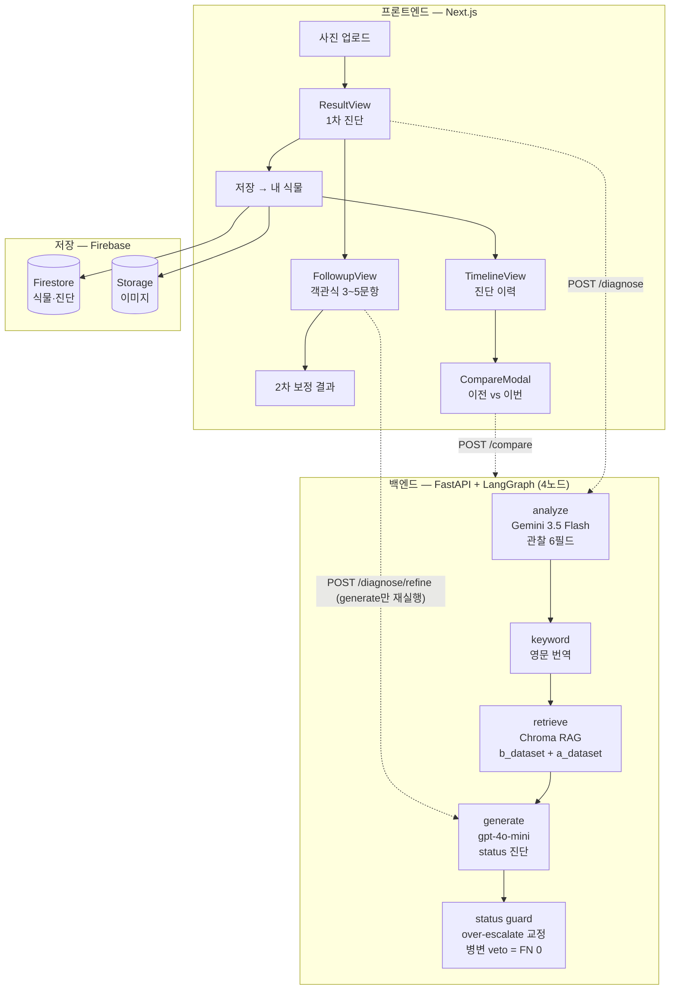

# Plantia — 식물 진단 AI 서비스

> 식물 사진 한 장으로 1차 진단을 내리고, 객관식 후속 질문으로 보정한 2차 진단까지 제공하는 풀스택 AI 서비스.
> **핵심은 모델이 아니라 측정이다 — 라운드 기반 평가로 LLM 진단 파이프라인을 통제·개선했다.**

Vision(Gemini) → RAG 검색 → 생성(LLM) → **status 후처리 가드**로 이어지는 진단 파이프라인을, 한 라운드에 한 변수만 격리해 측정하는 평가 중심 방식으로 만들었습니다. (FastAPI + LangGraph 백엔드 / Next.js + Firebase 프론트엔드)

---

## 핵심 (시그니처)

**시그니처 1 — 치명적 오진 0건을 하드 게이트로 사수**

- 가장 위험한 실수 = "진짜 아픈 식물(비건강)을 건강으로 오진하는 것"(`cardinal_miss`). 이걸 **0건**으로 두는 것을 절대 사수 게이트로 삼고, 모든 라운드에서 recall **1.0**을 유지했습니다.
- 안전판은 코드에 박혀 있습니다: status 후처리 가드가 건강으로 교정하려 할 때 **병변 단어(고사·마름·황화·반점·괴사 등)가 하나라도 있으면 교정을 거부**(veto)합니다.

**시그니처 2 — 입력 설득 4회 실패 → 출력 후처리로 우회 (오탐 절반↓)**

- 모델의 과대진단(건강한 식물을 "아프다"고 오탐)을 줄이려고 **프롬프트로 4번 시도했고, 전부 효과 0임을 측정으로 확인**했습니다. "LLM에 추상 원칙을 주입하는 입력 설득의 한계"라고 판단.
- 방향을 틀어 **출력 단계에서 status enum만 교정하는 후처리 가드**로 우회 → 이진 측정 기준 오탐(FP) **17.5 → 7.5로 절반 감축**(cardinal_miss 0 유지).

**시그니처 3 — 이진을 3단(건강/경미/비건강)으로 확장**

- "프롬프트·프레이밍으로는 더 못 푼다"는 진단 끝에, 정답 라벨에 **심각도 차원(tier)**을 추가. 미용적 변색(경미)과 병리(비건강)를 분리해 측정할 수 있게 됐고, 이진 FP를 추가로 절반(10→5) 줄였습니다.

> 측정 한계(정직): 평가셋 39장 규모, analyze 비결정성 ±1~2 노이즈, 단일 run 기준 — 게이트는 항상 이 한계를 명시하고 설계했습니다.

---

## 발견의 흐름 — 어떻게 여기까지 왔나

### 단계 1. 환각을 프롬프트로 잡으려 했지만 (실패)

"없는 병을 지어낸다"는 환각이 오탐의 원인이라 보고, 프롬프트에 관찰 충실성 원칙을 넣고·모델을 최신형으로 바꿔봤습니다. **모두 효과 0 또는 악화**(antifab 시도: FP 13→16). 최신 Vision 모델로 바꿔도 오진은 똑같이 발생 — 입력 설득의 한계를 측정으로 확인.

### 단계 2. 출력 후처리 가드로 우회 (성공)

설득 대신 **generate 출력 뒤에서 status enum 값만 교정**하는 가드를 도입. 끝·가장자리에 국한된 변색(cosmetic)은 건강으로 내리되, 병변 단어가 보이면 비건강을 유지(FN 0 안전판). 오탐 17.5 → 7.5.

### 단계 3. 진짜 병목은 스키마였다 → 3단 tier 도입

남은 오탐을 추적하니 "미용 vs 병리"를 가르는 **심각도 차원의 부재**가 본질이었습니다. 정답 라벨에 `tier`(건강/경미/비건강)를 추가하고 채점을 3단으로 확장 → "한 칸 과대(경미를 비건강으로)"와 "완전 오탐"을 분리 측정.

### 단계 4. Vision 모델 교체 — 측정으로 결정

analyze 모델을 `Gemini 2.5 Pro` → `Gemini 3.5 Flash`로 교체. 같은 평가셋에서 **정확도 중립(FP 13→14, 1케이스)·recall 1.0 유지**를 확인하고 **속도를 근거로 채택**. "최신이라서"가 아니라 "측정해서" 결정.

### 단계 5. 제품화 — 1차 진단을 서비스로

진단 파이프라인 위에 제품 레이어를 올렸습니다: 4개 화면(홈·결과·케어가이드·내 식물), 객관식 2차 보정 챗봇, 진단 이력 타임라인, 이전 vs 이번 진단 비교. Firebase 인증·저장 연동.

---

## 시스템 아키텍처



설계 결정:

- **책임 분리** — analyze는 "관찰"(6필드: 종 식별·묘사·증상), generate는 "진단"(status enum)만. analyze의 인상과 RAG가 가져온 근거가 다를 수 있으므로 강제로 일치시키지 않습니다.
- **status 가드는 출력 후처리** — 입력(프롬프트)으로 안 풀린 과대진단을 출력 단계에서 enum만 교정. JSON 구조·설명문·언어는 불변.
- **2차 보정은 generate만 재실행** — 객관식 답변을 받아 Gemini(analyze)·임베딩 재호출 없이 generate+guard만 다시 돌립니다. `observed_symptoms`는 1차 값 불변으로 전달돼 **동일 가드를 통과 → cardinal_miss 0 구조 보존**.

---

## 진단 파이프라인 상세

| 노드 | 모델 / 도구 | 역할 |
|---|---|---|
| **analyze** | Gemini 3.5 Flash (Vertex global) | 종 식별·시각 묘사·증상 관찰 6필드 추출 |
| **keyword** | gpt-4o-mini | 한국어 증상 명사구를 영문으로 번역(영문 코퍼스 검색용) |
| **retrieve** | Chroma + `text-embedding-ada-002` | `b_dataset_rag`(top-7) + `a_dataset_rag`(top-3), cosine ≥ 0.65 필터·가중 랭킹 |
| **generate** | gpt-4o-mini | RAG 근거 + 관찰 정보로 구조화 진단(status) 생성 |
| **status guard** | 규칙 기반 후처리 | over-escalate 교정 — 병변 veto·하부 위치 veto로 FN 0 사수 |

- **5-status 분류**: 건강 / 과습 / 건조 / 병해 의심 / 영양 부족 (+ `비건강-원인미상`)
- **3단 tier**: 건강 / 경미 / 비건강 — 심각도 차원
- **비대칭 게이트**: 비건강→건강 오분류(`cardinal_miss`) = 0 하드 게이트, 비건강→경미(`soft_miss`) = 추적·최소화, 과대(건강/경미→비건강) = 최소화

---

## 제품 기능

| 기능 | 설명 |
|---|---|
| **1차 진단** | 사진 업로드 → 진단 카드(status·원인·설명) + 종별 케어 가이드 첨부 |
| **2차 보정(챗봇)** | 물 주기·위치·최근 변화 등 객관식 3~5문항 답변을 반영한 보정 진단 |
| **내 식물 / 타임라인** | 진단을 식물별로 저장하고 이력을 시간순으로 열람 |
| **진단 비교** | 같은 식물의 이전 vs 이번 진단을 정성 비교("지난주보다 갈변 진행") |

---

## 기술 스택

- **백엔드**: FastAPI, LangGraph(4노드 파이프라인), Pydantic
- **Vision**: Gemini 3.5 Flash (Vertex AI global / AI Studio fallback)
- **LLM / 임베딩**: OpenAI gpt-4o-mini(생성·번역·비교) · `text-embedding-ada-002`
- **RAG**: Chroma (`b_dataset_rag` + `a_dataset_rag`)
- **프론트엔드**: Next.js, React, TypeScript
- **저장 / 인증**: Firebase (Auth · Firestore · Storage)
- **평가 / 테스트**: 자체 평가 하니스(`scripts/run_eval.py`) · pytest

---

<details>
<summary>평가 방법론 — 라운드 기반 변수 격리</summary>

이 프로젝트의 핵심은 **한 라운드 = 한 변수**라는 측정 규율입니다.

- 라운드마다 "이번에 바꾸는 변수는 정확히 무엇인가"를 명시하고, 그 외 영역(코드·프롬프트·카드·가드·RAG)은 동결합니다.
- 변경 후 합성 검증(import·pytest 회귀·grep) → 측정(Gemini 과금) → 게이트 판정 → 비교 앵커 갱신 순으로 진행.
- 측정 출력은 항상 명시 경로(`RUN_EVAL_OUT`)로 저장 — 기준 파일 덮어쓰기 사고를 방지.
- 효과 없는 변경(surface 패치·dead metadata)은 정기적 "빼기 라운드"로 제거해 본질 기여만 남깁니다.

**검색 품질**도 별도 골든셋으로 측정: Hit@10 = 1.0 / MRR = 0.9.

게이트 표·혼동표·사고 전례는 `CLAUDE.md`와 `docs/work_history/`에 라운드별로 누적되어 있습니다.

</details>

<details>
<summary>측정 결과 (3단 tier 채점, 평가셋 39장)</summary>

현 생산 모델(Gemini 3.5 Flash) 기준, generate가 "경미"를 출력하도록 한 라운드(R17):

| 지표 | 값 |
|---|---|
| 🔴 cardinal_miss (비건강→건강) | **0** (하드 게이트 사수) |
| exact_match (3×3) | 26/39 (66.7%) |
| soft_miss (비건강→경미) | 4 (감점, 하드 실패 아님) |
| 이진 환산 FP | 5 (직전 라운드 10 → 5) |
| recall | 1.0 (cardinal 기준) |

> soft_miss 4건 중 3건은 과거 사용자 재라벨에서도 경계로 분류된 케이스 — 모델이 사람과 유사하게 "경미"를 출력. FP 절반↓을 진전으로, soft_miss 4는 수용 한계로 기록.

</details>

<details>
<summary>설치 · 실행</summary>

### 백엔드 (FastAPI)

Python 3.12.

```bash
python -m venv .venv
.venv\Scripts\activate          # Windows
pip install -r requirements.txt
uvicorn app.main:app --reload --port 8000
```

Swagger UI: `http://localhost:8000/docs`

### 프론트엔드 (Next.js)

```bash
npm install
npm run dev                      # http://localhost:3000
```

### 환경 변수 (`.env`)

| 변수 | 용도 |
|---|---|
| `GOOGLE_CLOUD_PROJECT` | analyze — Vertex AI 모드(권장) |
| `GOOGLE_CLOUD_LOCATION` | Vertex region (`global`, Gemini 3.5 Flash) |
| `GEMINI_API_KEY` | analyze — AI Studio 모드(fallback) |
| `OPENAI_API_KEY` | generate·번역·임베딩 |

Vertex 모드는 `gcloud auth application-default login` 1회 필요. 모델/리전 롤백은 세션 env override(`ANALYZE_MODEL`·`GOOGLE_CLOUD_LOCATION`)로 가능.

### 테스트 · 평가

```bash
pytest -m "not integration"      # 회귀 (실 API 미호출)

$env:RUN_EVAL_OUT="after_acc_<라운드명>.json"
.venv\Scripts\python.exe scripts\run_eval.py --aux   # 평가셋 측정 (Gemini 과금)
```

</details>

<details>
<summary>API 요약</summary>

| 메서드 | 경로 | 설명 |
|---|---|---|
| `GET` | `/health` | 상태·키 설정 여부 |
| `POST` | `/diagnose` | 이미지 업로드 → 1차 진단(analyze→keyword→retrieve→generate→guard) |
| `POST` | `/diagnose/refine` | 객관식 답변 반영 2차 보정 (generate만 재실행, Gemini·임베딩 미호출) |
| `POST` | `/compare` | 같은 식물의 이전 vs 이번 진단 정성 비교 |

</details>

<details>
<summary>폴더 구조</summary>

```
plant-diagnosis/
├── app/                      # 백엔드 (FastAPI + LangGraph)
│   ├── vision/               # VisionProvider Protocol + GeminiProvider
│   ├── nodes/                # analyze_node
│   ├── graph.py              # 4노드 파이프라인 + status guard
│   ├── prompts.py · model_utils.py · care_guide.py · schemas.py
│   └── main.py               # /diagnose · /diagnose/refine · /compare
├── pages/ · components/ · lib/  # 프론트엔드 (Next.js)
├── scripts/run_eval.py       # 평가 하니스 (혼동표·--aux)
├── test_data/                # 평가셋 라벨(이미지는 git 제외) · labeling_vocab
├── eval/                     # 측정 결과·비교 앵커
├── data/vector_db/           # Chroma (b_dataset_rag · a_dataset_rag)
└── docs/work_history/        # 라운드별 진단·작업·결과 기록
```

</details>

<details>
<summary>데이터 · 라이선스</summary>

- 코드: MIT.
- RAG 코퍼스: PennState Extension(Houseplant Problems)·Missouri Botanical Garden·UC IPM·농촌진흥청 등 실내식물 도메인 자료(출처·라이선스 별도 관리).
- 평가셋 이미지는 git에서 제외(iNaturalist CC BY 등 라이선스·용량·토큰 고려) — `labels.json`의 `image_path`로 동일 경로 배치 시 작동.
- Gemini·OpenAI 각 서비스 약관·API 정책 준수.

</details>
