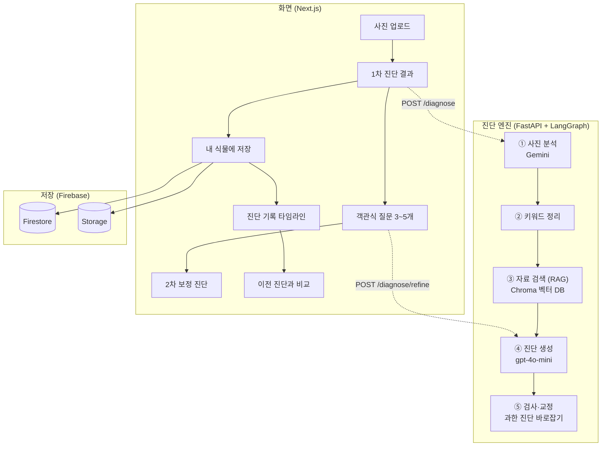

# 🌱 Plantia — 식물 사진으로 진단해주는 AI 서비스

식물 사진을 올리면 **건강한지, 물이 너무 많은지/적은지, 병에 걸린 것 같은지**를 알려주고,
몇 가지 질문에 답하면 진단을 더 다듬어주는 서비스입니다.

AI 엔지니어링을 공부하면서, **"그럴듯한 답을 내는 것"과 "믿을 수 있는 답을 내는 것"은 완전히 다른 문제**라는 걸 이 프로젝트에서 제일 크게 배웠습니다.

`FastAPI` · `LangGraph` · `Gemini` · `RAG (Chroma)` · `Next.js` · `Firebase`

---

## 무엇을 만들고 싶었나

화분이 시들어가는데 이유를 모를 때가 많습니다. 물을 더 줘야 할지, 병에 걸린 건지… 그래서 **사진 한 장으로 답을 주는 것**을 만들어보고 싶었습니다.

그런데 만들다 보니 진짜 어려운 건 'AI가 답을 내게 하는 것'이 아니라, **'AI가 틀린 답을 자신 있게 말하지 않게 하는 것'** 이었습니다.

## 가장 신경 쓴 것 — 위험한 실수를 막기

진단에서 제일 위험한 실수는 **진짜 아픈 식물을 "건강해요"라고 안심시키는 것**입니다. 사람이 그 말을 믿고 식물을 방치하게 되니까요.

그래서 이 실수(아픈데 건강이라고 하는 것)를 **한 건도 내지 않는 것**을 가장 중요한 기준으로 잡았고, 측정할 때마다 끝까지 0건을 지켰습니다.

## 제일 많이 배운 부분 — 프롬프트로 안 되면, 다른 방법을 찾기

처음엔 AI가 "없는 병을 지어내는 것"이 문제라고 생각했습니다. 그래서 프롬프트에 "있는 그대로만 봐라" 같은 규칙을 넣고, 모델도 더 좋은 걸로 바꿔봤습니다.

그런데 **네 번을 시도했는데, 측정해보니 전부 효과가 없었습니다.** 프롬프트(입력)를 아무리 다듬어도 안 풀리는 영역이 있다는 걸 데이터로 확인한 순간이었습니다.

그래서 방법을 바꿨습니다. AI가 답을 낸 **다음에**, 그 답을 검사해서 과한 진단을 코드로 교정하는 단계를 붙였습니다. 잎 끝이 살짝 변색된 정도면 건강으로 내리고, 진짜 병처럼 보이는 단어가 있으면 절대 손대지 않습니다. 그 결과 **헛걱정(건강한데 아프다고 한 경우)을 절반으로 줄였습니다** — 아픈 걸 놓치는 실수는 0건을 유지하면서요.

> 이 경험이 제일 기억에 남습니다. "안 되는 걸 끝까지 우기지 말고, 측정해서 인정하고 다른 길을 찾는다"는 걸 배웠습니다.

## 어떻게 동작하나요



흐름을 말로 풀면 이렇습니다.

1. **사진을 본다** — Gemini가 식물 종류와 눈에 보이는 증상을 글로 정리합니다.
2. **자료를 찾는다** — 그 증상으로 식물 자료(벡터 DB)에서 비슷한 내용을 검색합니다. (RAG)
3. **진단을 쓴다** — 찾은 자료를 바탕으로 진단 문장을 만듭니다.
4. **검사하고 고친다** — 위에서 말한, 과한 진단을 코드로 교정하는 단계입니다.

그리고 그 위에 사진 업로드 화면, 추가 질문으로 보정하는 2차 진단, 내 식물 기록·비교 같은 제품 기능을 Next.js + Firebase로 붙였습니다.

## 어떻게 좋아졌는지 (측정)

"좋아진 것 같다"는 느낌이 아니라, 매번 **같은 평가셋(식물 사진 39장)으로 숫자를 재면서** 바꿨습니다. 한 번에 한 가지만 바꾸고, 그 변화가 진짜 효과가 있었는지 비교했습니다.

| 무엇을 봤나 | 결과 |
|---|---|
| 아픈 식물을 건강으로 오진 (제일 위험한 실수) | **0건 유지** |
| 헛걱정 (건강한데 아프다고 함) | **17.5 → 7.5** (절반) |
| 검색이 맞는 자료를 찾았는지 | Hit@10 1.0 / MRR 0.9 |

평가셋이 39장으로 작아서 한두 건은 노이즈일 수 있다는 한계도 같이 적어두고 봤습니다.

## 기술 스택

- **백엔드**: FastAPI, LangGraph
- **AI**: Gemini(사진 분석), OpenAI gpt-4o-mini(진단 문장·번역), 임베딩(자료 검색)
- **RAG**: Chroma 벡터 DB
- **프론트엔드**: Next.js, React, TypeScript
- **저장 / 로그인**: Firebase (Firestore · Storage · Auth)
- **테스트 / 평가**: pytest, 자체 평가 스크립트(`scripts/run_eval.py`)

---

<details>
<summary>실행 방법</summary>

### 백엔드 (FastAPI)

```bash
python -m venv .venv
.venv\Scripts\activate          # Windows
pip install -r requirements.txt
uvicorn app.main:app --reload --port 8000
```

API 문서: `http://localhost:8000/docs`

### 프론트엔드 (Next.js)

```bash
npm install
npm run dev                      # http://localhost:3000
```

### 환경 변수 (`.env`)

| 변수 | 용도 |
|---|---|
| `GOOGLE_CLOUD_PROJECT` | 사진 분석 — Vertex AI 모드(권장) |
| `GOOGLE_CLOUD_LOCATION` | Vertex 지역 (`global`) |
| `GEMINI_API_KEY` | 사진 분석 — AI Studio 모드(대체) |
| `OPENAI_API_KEY` | 진단 문장 생성·번역·임베딩 |

키는 코드에 넣지 않고 `.env`로 불러옵니다. Vertex 모드는 `gcloud auth application-default login`을 한 번 실행하면 됩니다.

</details>

<details>
<summary>API</summary>

| 메서드 | 경로 | 설명 |
|---|---|---|
| `GET` | `/health` | 서버 상태 확인 |
| `POST` | `/diagnose` | 사진 업로드 → 1차 진단 |
| `POST` | `/diagnose/refine` | 객관식 답변 반영 2차 진단 |
| `POST` | `/compare` | 같은 식물의 이전 vs 이번 진단 비교 |

</details>

<details>
<summary>폴더 구조</summary>

```
plant-diagnosis/
├── app/              # 백엔드 (FastAPI + LangGraph)
│   ├── vision/       # 사진 분석 (Gemini)
│   ├── graph.py      # 진단 파이프라인 + 검사·교정 단계
│   ├── prompts.py · model_utils.py · care_guide.py · schemas.py
│   └── main.py       # API (/diagnose · /diagnose/refine · /compare)
├── pages/ · components/ · lib/   # 프론트엔드 (Next.js)
├── scripts/          # RAG 구축·평가 스크립트
├── test_data/        # 평가셋 라벨 (이미지는 라이선스·용량 때문에 제외)
└── tests/            # pytest
```

</details>

<details>
<summary>데이터 · 라이선스</summary>

- 코드: MIT
- RAG 자료: PennState Extension, Missouri Botanical Garden, UC IPM, 농촌진흥청 등 실내식물 자료 (출처별 라이선스 준수)
- 평가셋 사진은 라이선스·용량 때문에 저장소에서 제외했습니다 (`labels.json`의 경로만 공유).

</details>
