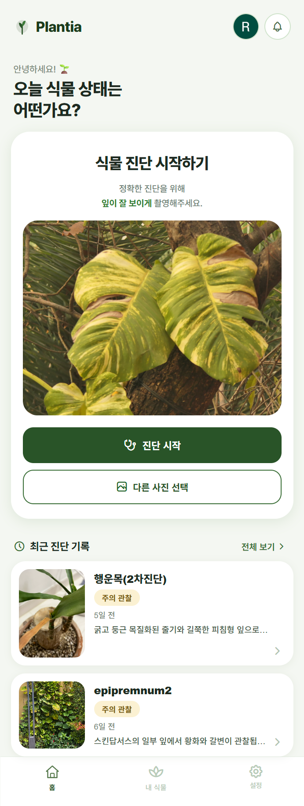
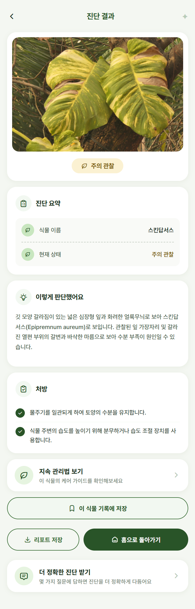
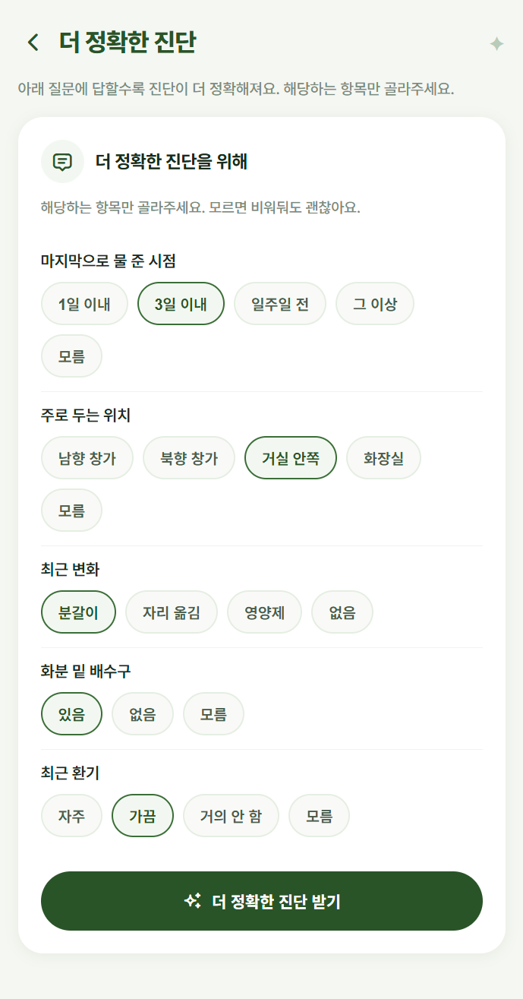
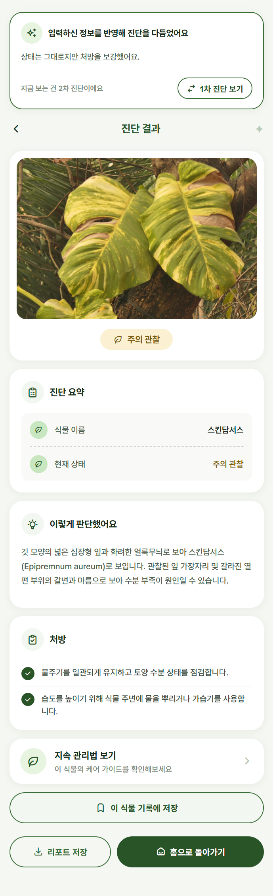
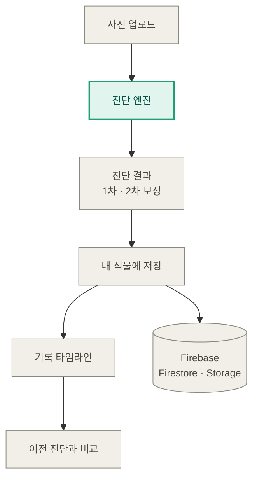
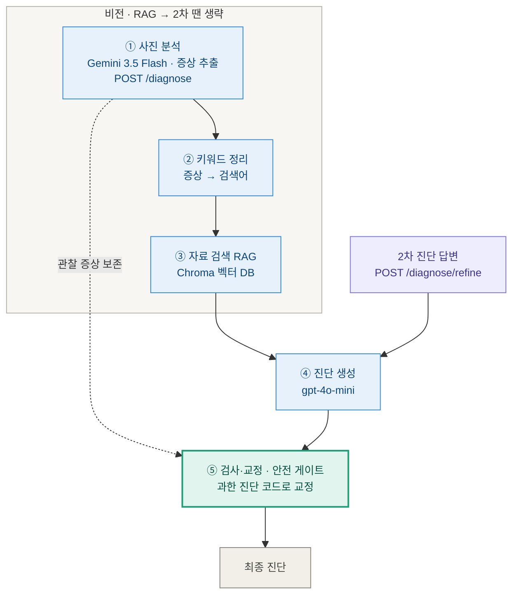

# 🌱 Plantia — 식물 사진으로 진단해주는 AI 서비스

식물 사진을 올리면 건강한지, 물이 너무 많은지/적은지, 병에 걸린 것 같은지를 알려주고,
몇 가지 질문에 답하면 진단을 더 다듬어주는 서비스입니다.

AI 엔지니어링을 공부하면서 **"그럴듯한 답을 내는 것"과 "믿을 수 있는 답을 내는 것"은 완전히 다른 문제**라는 사실을 이 프로젝트에서 제일 크게 배웠습니다.

`FastAPI` · `LangGraph` · `Gemini 3.5 Flash` · `RAG (Chroma)` · `Next.js` · `Firebase`

---

## 주요 화면

**진단 흐름** : 사진 업로드 → 1차 진단 → 추가 질문 → 2차 보정

<table>
  <tr>
    <td align="center"><sub>홈 · 진단 시작</sub></td>
    <td align="center"><sub>1차 진단 결과</sub></td>
    <td align="center"><sub>추가 질문 (2차)</sub></td>
    <td align="center"><sub>2차 보정 결과</sub></td>
  </tr>
  <tr>
    <td align="center" valign="top"></td>
    <td align="center" valign="top"></td>
    <td align="center" valign="top"></td>
    <td align="center" valign="top"></td>
  </tr>
</table>

**▶️ 데모 영상** : 실제 진단 흐름을 영상으로 확인할 수 있습니다. (클릭하면 유튜브로 이동)

<a href="https://youtu.be/qi5_bJOjuVs">
  
</a>

## 만든 이유

집에서 식물 두 개를 키웁니다. 화분이 시들어가는데 이유를 모를 때가 많고, 매번 가게에 갈 수도 없어서 LLM에 물어봤지만 이 답을 믿어도 되는지 종종 의심스러웠습니다. 물을 더 줘야 할지, 병에 걸린 건지 답답한 마음에 사진 한 장으로 답을 주는 앱을 만들어보고 싶었습니다.

그런데 만들다 보니 진짜 어려운 건 'AI가 답을 내게 하는 것'이 아니라, 'AI가 틀린 답을 자신 있게 말하지 않게 하는 것'이었습니다.

## 가장 신경 쓴 것

진단에서 제일 위험한 실수는 진짜 아픈 식물을 "건강해요"라고 안심시키는 것입니다. 사람이 그 말을 믿고 식물을 방치하게 되니까요.

그래서 이 실수(아픈데 건강이라고 하는 것)를 한 건도 내지 않는 것을 가장 중요한 기준으로 잡았습니다. 다른 지표를 개선할 때도 이 선만큼은 절대 넘지 않는 것을 전제로 뒀습니다.

## 가장 많이 배운 것

처음엔 AI가 없는 병을 지어내는 것이 문제라고 생각했습니다. 그래서 프롬프트에 "있는 그대로만 봐라"와 같은 규칙을 넣고 모델도 더 좋은 걸로 바꿔봤습니다.

여러 번을 시도했지만 측정해보니 전부 효과가 없었습니다. 프롬프트(입력)를 아무리 다듬어도 안 풀리는 영역이 있다는 걸 데이터로 확인한 순간이었습니다.

그래서 방법을 바꿨습니다. 앞 단계의 정보를 받아 AI가 추론을 마친 다음에, 그 추론을 검사해서 과한 진단을 코드로 교정하는 단계를 붙였습니다. 잎 끝이 살짝 변색된 정도면 건강으로 내리고, 진짜 병처럼 보이는 단어가 있으면 절대 손대지 않고 AI의 추론을 그대로 통과시킵니다. 이 전환이 실제로 효과가 있었는지는 아래 측정 결과에서 숫자로 확인했습니다.

이 경험이 제일 기억에 남습니다. 같은 방법을 고집하기보다, 측정을 통해 한계를 인정하고 다른 접근으로 전환하는 판단이 더 중요하다는 걸 배웠습니다.

## 정답지에 '경미'를 더한 것

처음엔 진단을 '건강 / 아픔' 두 가지로만 나눴습니다. 그런데 측정해보니, 100% 건강하다고는 못 하지만 그렇다고 증상이 있다고 보기도 애매한, 경계에 걸친 식물이 문제였습니다. 이런 어정쩡한 상태를 모델이 '건강' 아니면 '아픔' 둘 중 하나로만 골라야 하니, 자꾸 '아픔' 쪽으로 밀어 헛걱정(오탐)을 만들고 있었던 것입니다.

그래서 정답지(평가 기준)에 **'경미'라는 중간 단계**를 새로 만들고, 모델도 이 단계를 답할 수 있게 했습니다. 사람처럼 "미용상 문제인지, 진짜 병인지" 사이에 한 칸을 더 준 것입니다.

같은 평가셋 39장으로 다시 재보니, 남아 있던 **헛걱정이 10건 → 5건으로 다시 절반**이 됐습니다. 그러면서도 **제일 위험한 실수(아픈데 건강이라고 함)는 계속 0건**을 지켰습니다.

## 동작 방식

먼저 아키텍처 전체 흐름은 이렇습니다.



이 중 핵심인 **진단 엔진** 내부를 펼치면 다음과 같습니다.



사진에서 증상을 뽑고(①), 키워드로 자료를 검색한 뒤(②③), 진단을 생성하고(④), 마지막 ⑤번에서 과한 진단을 코드로 교정합니다. 이 ⑤번 검사·교정 게이트가 위 「가장 많이 배운 것」에서 붙인 그 단계입니다.

그리고 그 위에 사진 업로드 화면, 추가 질문으로 보정하는 2차 진단, 내 식물을 기록하고 비교하는 기능을 Next.js + Firebase로 구현했습니다.

## 측정 결과

"좋아진 것 같다"는 느낌이 아니라, 매번 같은 평가셋(식물 사진 39장)으로 숫자를 재면서 바꿨습니다. 한 번에 한 가지만 바꿔보면서, 그 변화가 진짜 효과가 있었는지 비교했습니다.

헛걱정(오탐)을 줄이는 데는 두 번의 전환점이 있었습니다.

**1단계 — 후처리 가드.** AI가 낸 진단을 코드로 한 번 더 검사해 과한 진단을 교정하는 단계(위 ⑤번)를 붙였더니, 오탐이 절반으로 줄었습니다. *(이진 기준 17.5건 → 7.5건, 치명적 오진 0건 유지)*

**2단계 — 정답지에 '경미' 추가.** 그래도 절반이 남았습니다. 남은 오탐을 들여다보니 문제는 진단 방식이 아니라 정답지가 두 칸뿐이라는 데 있었습니다. 경계 상태를 담을 '경미' 칸을 더하고 다시 측정하니, 남은 오탐이 또 절반으로 줄었습니다. *(10건 → 5건, 역시 치명적 오진 0건 유지)*

두 측정은 정답지 기준이 서로 달라 숫자를 그대로 이어 붙일 수는 없지만, 두 번 모두 "오탐은 절반으로, 가장 위험한 실수는 0건"이라는 같은 결과를 냈습니다.

| 무엇을 봤나 | 결과 |
|---|---|
| 아픈 식물을 건강으로 오진 (제일 위험한 실수) | 0건 유지 |
| 헛걱정 (건강한데 아프다고 함) | 17.5 → 7.5 (절반) |
| 검색이 맞는 자료를 찾았는지 | Hit@10 1.0 / MRR 0.9 |

평가셋이 39장으로 작아서 한두 건은 노이즈일 수 있다는 한계도 함께 적어두었습니다.

## 기술 스택

- **백엔드** : FastAPI, LangGraph
- **AI** : Gemini 3.5 Flash(사진 분석), OpenAI gpt-4o-mini(진단 문장·번역), 임베딩(자료 검색)
- **RAG** : Chroma 벡터 DB
- **프론트엔드** : Next.js, React, TypeScript
- **저장 / 로그인** : Firebase (Firestore · Storage · Auth)
- **테스트 / 평가** : pytest, 자체 평가 스크립트(`scripts/run_eval.py`)

---

<details>
<summary>실행 방법</summary>

### 백엔드 (FastAPI)

```bash
python -m venv .venv
.venv\Scripts\activate          # Windows
pip install -r requirements.txt
uvicorn app.main:app --reload --port 8001
```

API 문서: `http://localhost:8001/docs`

### 프론트엔드 (Next.js)

```bash
npm install
npm run dev                      # http://localhost:3000
```

### 환경 변수 (`.env`)

| 변수 | 용도 |
|---|---|
| `GOOGLE_CLOUD_PROJECT` | 사진 분석 — Vertex AI 모드(권장) |
| `GOOGLE_CLOUD_LOCATION` | Vertex 지역 (`global`) |
| `GEMINI_API_KEY` | 사진 분석 — AI Studio 모드(대체) |
| `OPENAI_API_KEY` | 진단 문장 생성·번역·임베딩 |

키는 코드에 넣지 않고 `.env`로 불러옵니다. Vertex 모드는 `gcloud auth application-default login`을 한 번 실행하면 됩니다.

</details>

<details>
<summary>API</summary>

| 메서드 | 경로 | 설명 |
|---|---|---|
| `GET` | `/health` | 서버 상태 확인 |
| `POST` | `/diagnose` | 사진 업로드 → 1차 진단 |
| `POST` | `/diagnose/refine` | 객관식 답변 반영 2차 진단 |
| `POST` | `/compare` | 같은 식물의 이전 vs 이번 진단 비교 |

</details>

<details>
<summary>폴더 구조</summary>

```
plant-diagnosis/
├── app/              # 백엔드 (FastAPI + LangGraph)
│   ├── vision/       # 사진 분석 (Gemini)
│   ├── nodes/        # 파이프라인 노드 (analyze 등)
│   ├── graph.py      # 진단 파이프라인 + 검사·교정 단계
│   ├── prompts.py · model_utils.py · care_guide.py · schemas.py
│   └── main.py       # API (/diagnose · /diagnose/refine · /compare)
├── pages/ · components/ · lib/   # 프론트엔드 (Next.js)
├── scripts/          # RAG 구축·평가 스크립트
├── test_data/        # 평가셋 라벨 (이미지는 라이선스·용량 때문에 제외)
└── tests/            # pytest
```

</details>

<details>
<summary>데이터 · 라이선스</summary>

- **코드** : MIT
- **RAG 자료(진단)** : 미국 대학 extension·식물원의 공개 실내식물 자료(UC IPM, Penn State Extension, University of Missouri Extension, Missouri Botanical Garden 등)를 **비상업·학습 목적**으로 참고했습니다. 원저작권은 각 기관에 있으며, 이 프로젝트는 해당 자료를 진단 생성의 **내부 참고**로만 사용합니다(모델이 자체 문장으로 재작성해 제공). 일부 자료는 공개 웹페이지에서 수집했고, 일부 보조 카드(건조·저수분 신호 등)는 제가 직접 작성한 요약입니다.
- **케어 가이드 · 종 정보** : 농촌진흥청 농사로 garden API (공공데이터, 종명별 관리 정보 — RAG 아님, lookup용)
- 평가셋 사진은 라이선스·용량 때문에 저장소에서 제외했습니다 (`labels.json`의 경로만 공유).
- ⚠️ 본 저장소는 **비상업 학습용 데모**입니다. 자료 재사용 시 각 출처의 이용약관을 따라야 합니다.

</details>
